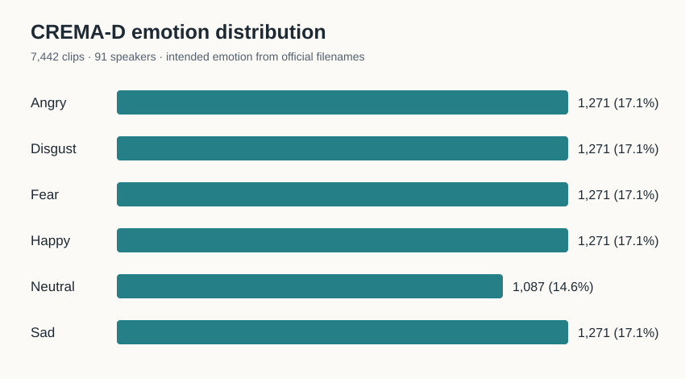
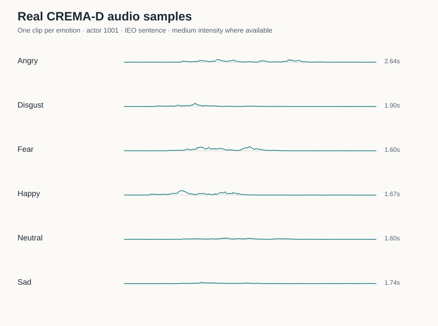

# Speech Emotion Recognition with CREMA-D

Deep Learning course project, initial dataset and problem-definition milestone. **No model has been trained.**

## Problem and task

An audio recording of a person speaking is the **input**. The **output** is one of six intended emotion labels: Angry, Disgust, Fear, Happy, Neutral, or Sad. This is supervised, six-class audio classification. A practical use is to study how well speech alone conveys emotion to an automated system. The recordings are acted English sentences, so performance on CREMA-D will not by itself establish reliability for spontaneous speech, other languages, or high-stakes decisions.

The project uses the emotion encoded in the official filename as the target label. CREMA-D also includes crowd ratings; those are separate annotations and are not used for this first milestone. Only audio is used, despite the source dataset also containing video.

## Dataset evidence

The [official CREMA-D repository](https://github.com/CheyneyComputerScience/CREMA-D) describes 7,442 original clips from 91 actors. Its `AudioWAV` recordings are accessible through Git LFS; the [official GitLab mirror](https://gitlab.com/cs-cooper-lab/crema-d-mirror) is an alternative. The checked-in [official filename index](data/metadata/SentenceFilenames.csv) contains 7,442 unique entries from 91 speakers. It was retrieved from the source repository and is included to reproduce counts and splits without downloading the full media corpus. The filename pattern is `ActorID_Sentence_Emotion_Intensity.wav`; the actor ID is the first field. The [dataset paper](https://pmc.ncbi.nlm.nih.gov/articles/PMC4313618/) describes the acted, multimodal collection and its crowdsourced ratings.

| Intended emotion | Filename code | Clips | Share |
|---|---:|---:|---:|
| Angry | ANG | 1,271 | 17.1% |
| Disgust | DIS | 1,271 | 17.1% |
| Fear | FEA | 1,271 | 17.1% |
| Happy | HAP | 1,271 | 17.1% |
| Neutral | NEU | 1,087 | 14.6% |
| Sad | SAD | 1,271 | 17.1% |



I inspected six actual WAV files, one per emotion, from actor 1001 and sentence `IEO`. They are mono, 16-bit PCM at 16 kHz. Their durations span 1.60–2.64 seconds. Exact filenames, durations, peak levels, and RMS levels are in [sample_inspection.csv](data/metadata/sample_inspection.csv). The figure below displays their amplitude envelopes, derived from the actual samples. These six clips illustrate the file format and variation; they are not used as evidence that the classes can be distinguished from waveform shape alone.



The source repository licenses the **database under ODbL 1.0** and **individual contents under DbCL 1.0**; see its [license statement](https://github.com/CheyneyComputerScience/CREMA-D#license). This repository includes metadata and derived figures, but no source audio. Obtain the corpus from its official repository or mirror and follow those license terms when using or redistributing it.

## Split and evaluation plan

The [fixed split manifest](data/metadata/splits.csv) assigns every clip by **speaker**, so no actor occurs in more than one partition. Sorted actor IDs are shuffled with Python `random.Random(471)`; the first 64 speakers form train, the next 13 validation, and the final 14 test. The resulting clip counts are:

| Partition | Speakers | Clips | Approx. share |
|---|---:|---:|---:|
| Train | 64 | 5,240 | 70.4% |
| Validation | 13 | 1,066 | 14.3% |
| Test | 14 | 1,136 | 15.3% |

This split is frozen before modeling. Train will be used for fitting, validation for model selection, and test for a single final evaluation. The **one validation metric is macro F1** across the six emotions. It gives every emotion equal weight despite Neutral having fewer samples. Preprocessing statistics, augmentations, and any learned transforms must be fitted on training clips only.

## Reproduce this milestone

Python 3.10+ is sufficient; exploration has no third-party package dependencies. From the repository root:

```bash
python3 src/explore_dataset.py
```

This validates the official index and regenerates `data/metadata/splits.csv` and `figures/emotion_distribution.svg`. To regenerate the real sample figure and inspection table, obtain these six official `AudioWAV` files and place them in `data/raw/AudioWAV/`: `1001_IEO_ANG_MD.wav`, `1001_IEO_DIS_MD.wav`, `1001_IEO_FEA_MD.wav`, `1001_IEO_HAP_MD.wav`, `1001_IEO_NEU_XX.wav`, and `1001_IEO_SAD_MD.wav`. Then run:

```bash
python3 src/explore_dataset.py --audio-dir data/raw/AudioWAV
```

Source audio remains local and is ignored by Git. The script validates the expected mono PCM format and regenerates `figures/sample_waveforms.svg` and `data/metadata/sample_inspection.csv`.

## Repository layout

- `src/explore_dataset.py` — metadata checks, speaker split, and figures
- `data/metadata/` — official filename index and derived reproducible manifests
- `data/raw/` — local audio location, ignored by Git
- `figures/` — distribution and inspected sample visualizations
- `proposal/` — course proposal notes and future submission
- `requirements.txt` — dependency status for this milestone

## Citation

Cao, H. et al. (2014). “CREMA-D: Crowd-sourced Emotional Multimodal Actors Dataset.” *IEEE Transactions on Affective Computing*, 5(4), 377–390. https://doi.org/10.1109/TAFFC.2014.2336244
